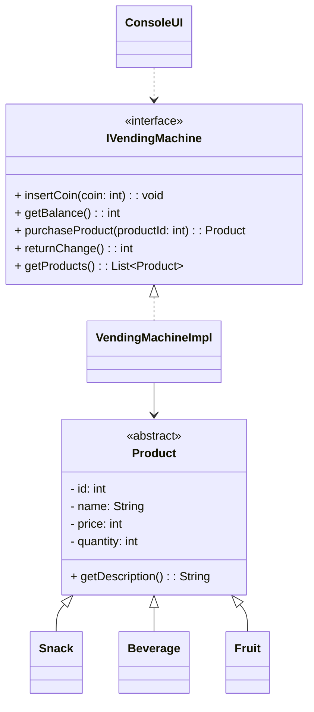

# Workshop — OOP 2 (Vending Machine)

---

## Objectives

In this workshop, you will design and implement a **Vending Machine application**
using **Object-Oriented Programming (OOP)** principles.

By completing this workshop, you will practice:

- Inheritance
- Polymorphism
- Abstraction
- Encapsulation
- Working with UML class diagrams
- Designing a simple Console UI

---

You are developing software for a **vending machine** used in a public place
(school, office, or shopping center).

The vending machine sells different kinds of products, such as:

- Snacks
- Beverages
- Fruits
- etc.

All products share common properties, but each product type has
its own **specific characteristics and behavior**.

The vending machine should allow a user to:

- View available products
- Select a product
- Purchase a product
- Reduce stock after purchase
- Interact using a **console-based menu**

The vending machine accepts **only specific coin values**: `1, 2, 5, 10, 20, 50`

Rules to follow:

- Any other coin value must be **rejected**
- Inserted coins increase the current balance
- A product can only be purchased if the balance is sufficient
- Remaining balance must be returned when requested

---

## Your Task

You will design and implement the vending machine system by following
the UML class diagram below.

Your implementation must:

- Follow the class diagram structure
- Use inheritance where appropriate
- Use polymorphism when handling different product types
- Apply encapsulation (private fields, getters/setters)
- Include a simple console UI for interaction
- Validate coin input according to the payment rules
- **Write JUnit tests for the core vending machine logic**
- **Build a runnable JAR file that can be executed from the command line**

---

## UML Class Diagram (Conceptual)

> **Note:**  
> The classes in this diagram are intentionally left **empty**.  
> You are expected to **design and implement** the fields, constructors,
> and method logic based on the scenario and requirements.

## JUnit Test Use Cases (Core Logic)

Write **JUnit tests** for the vending machine business logic (not ConsoleUI).

> ✅ Focus on testing `VendingMachineImpl` methods and product stock/balance rules.  
> ❌ Do NOT test console input/output or menu printing.

### Test Case 1 — Insert Valid Coin
**Given:** balance = 0  
**When:** insertCoin(10)  
**Then:** balance becomes 10

---

### Test Case 2 — Reject Invalid Coin
**Given:** balance = 0  
**When:** insertCoin(7)  
**Then:** balance stays 0 (coin is rejected)

---

### Test Case 3 — Purchase Product Successfully
**Given:** product price = 20, product quantity = 3, balance = 0  
**When:** insertCoin(20), purchaseProduct(productId)  
**Then:**
- purchase succeeds (returns Product)
- balance becomes 0
- quantity becomes 2

---

### Test Case 4 — Purchase Fails (Insufficient Balance)
**Given:** product price = 20, balance = 10  
**When:** purchaseProduct(productId)  
**Then:**
- purchase fails (e.g., returns `null` or throws exception)
- balance stays 10
- quantity unchanged

---

### Test Case 5 — Purchase Fails (Out of Stock)
**Given:** quantity = 0, balance >= price  
**When:** purchaseProduct(productId)  
**Then:**
- purchase fails
- balance unchanged
- quantity stays 0

---

### Test Case 6 — Return Change Resets Balance
**Given:** balance = 50  
**When:** returnChange()  
**Then:**
- returned value = 50
- balance becomes 0

---

### Test Case 7 — Get Products Returns All Items
**Given:** vending machine has 3 products added  
**When:** getProducts()  
**Then:** list size is 3

### Add More Test Cases as Needed

---

## Part 2 — (Optional / Challenge)

Extend the design by improving the system.

You may:

- Add one or more **new classes**
- Add **new fields or methods**
- Add **new relationships** that make sense

Explain in a short text:

- What you added
- Why you added it
- How it improves the system

